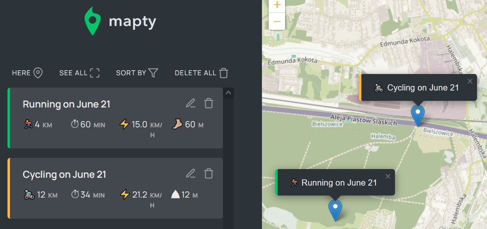

# Mapty App

LIVE: 

App created along with Jonas Schmedtmann's JavaScript course, with a few added functionalities of my own: sorting, editing, canceling, viewing all activities, and setting the actual location. The app uses the Leaflet map API and Local Storage.

Technologies used:
HTML, SCSS, JS

